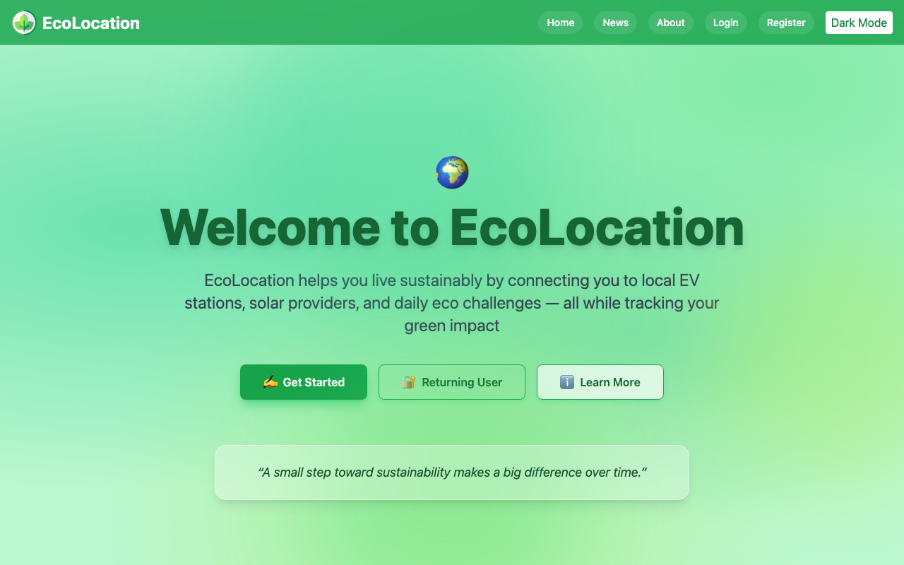
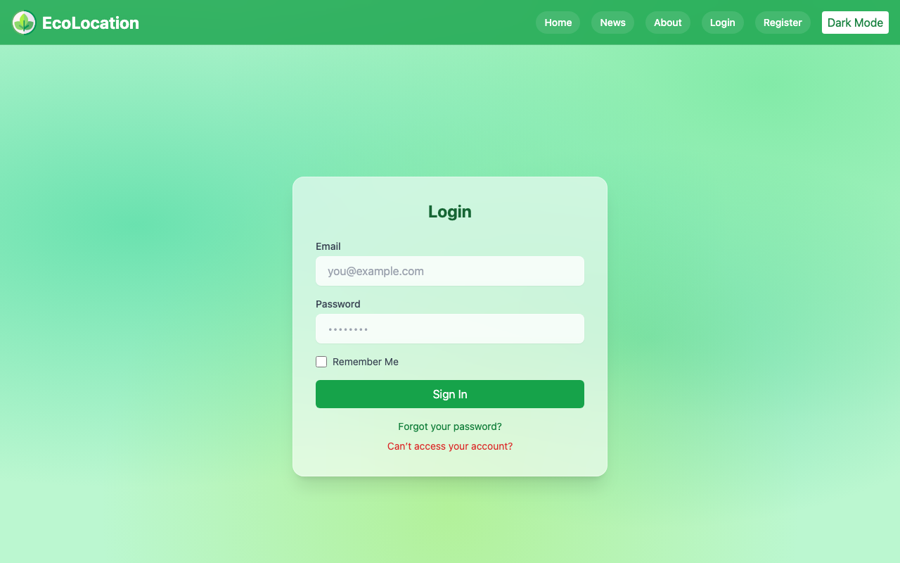

# EcoLocation 🌱

**Track your carbon footprint, find EV charging stations, and build eco habits — one day at a time.**

Built with React + Firebase as a full-stack PWA.

| Home | Login |
|:--:|:--:|
|  |  |

---

## Features

- **EV Charging Map** — live OpenChargeMap data on an interactive Leaflet map, with filters, custom pins, and a per-user favorites system
- **Carbon Calculator** — daily CO₂e estimate across transport, energy, flights, heating, and diet (EPA eGRID 2022 + IPCC AR6 factors), with persistent history and personalized reduction tips
- **Weekly Eco Challenges** — daily check-ins, confetti on completion, live leaderboard via Firestore
- **Green News Feed** — environmental articles from The Guardian API with topic filters, search, and pagination
- **Auth** — email/password login via Firebase Auth, with route protection and password reset
- **Dark mode** — full Tailwind dark mode with a fixed glassmorphism mesh background

---

## Tech Stack

React · Vite · Firebase (Auth + Firestore) · Tailwind CSS · Leaflet.js · Recharts · Express · react-hot-toast

---

## Setup

```bash
git clone https://github.com/your-username/EcoLocation.git
cd EcoLocation
npm install
```

Create a `.env` file in the root:

```env
VITE_FIREBASE_API_KEY=
VITE_FIREBASE_AUTH_DOMAIN=
VITE_FIREBASE_PROJECT_ID=
VITE_FIREBASE_STORAGE_BUCKET=
VITE_FIREBASE_MESSAGING_SENDER_ID=
VITE_FIREBASE_APP_ID=
VITE_OPENCHARGEMAP_KEY=
GUARDIAN_API_KEY=
ANTHROPIC_API_KEY=
```

Then run both the Vite dev server and the Express API:

```bash
npm run dev
```

App runs at [http://localhost:5175](http://localhost:5175) — the API runs at port 3001 and is proxied automatically.

---

## Notes

- Carbon factors sourced from EPA eGRID 2022, IPCC AR6, and Oxford Food & Climate Research
- Eco tips use Claude Haiku via the Anthropic API
- PWA-ready: mobile-first layout with ARIA support and keyboard navigation
